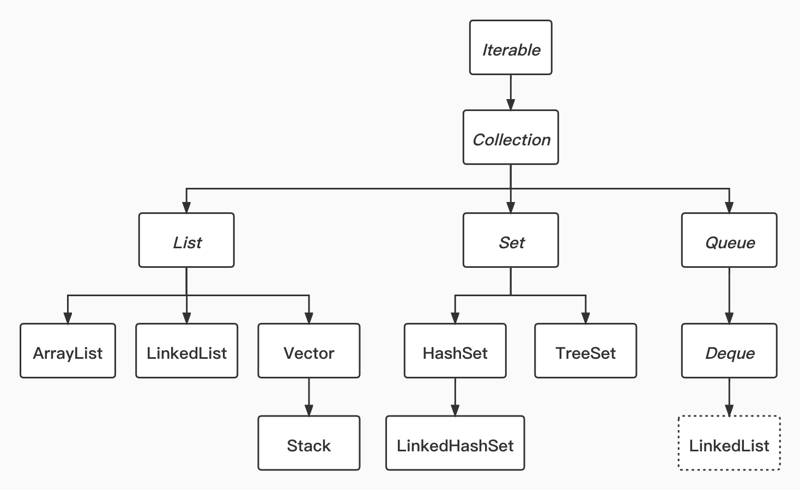

# Java集合体系-collection(局部)

### <a name="iterable">*Iterable*</a>
##### 定义可`for each loop`的对象   
> 提供以下功能接口定义：   
>>+ iterator(): <a href="#iterator">Iterator</a> 返回泛型定义类型的迭代器   
>>+ [JDK8]forEach(Consumer): void (对集合元素)按迭代顺序执行给定的操作
>>+ spliterator(): Spliterator 返回泛型定义类型的拆分器

### <a name="collection">*Collection*</a>
##### 集合框架的根接口，具有最大通用性
##### 直接继承自<a href="#iterable">*Iterable*</a>
> 提供一下功能接口定义：   
>>+ size(): int 获取集合中的元素数   
>>+ isEmpty(): boolean 集合中是否无元素   
>>+ <a name="contains">contains(Object): boolean</a> 集合中是否存在(o == null ? e == null : o.equals(e))给定元素   
>>+ toArray(): Object[] 返回包含集合中所有元素的数组，如集合保证迭代顺序，则返回的数组也`保证迭代顺序`；返回的数组为`新数组`(非集合本身底层数据结构)，对数组的操作不影响原集合   
>>+ toArray(T[]): T[] 返回包含集合中所有元素的数组，返回数组的元素类型与给定数组元素类型一致；给定数组长度不足时分配新的数组；足够容纳时返回给定数组，空闲位置填充null   
>>+ add(E): boolean 添加元素到集合中，集合因此发生变化时返回true；因一些限制而无效更新时返回false    
>>+ remove(Object): boolean 从集合中删除给定元素(如果<a href="#contains">存在</a>多个，删除第一个)   
>>+ containsAll(Collection): boolean 集合中是否存在给定集合中的所有元素   
>>+ addAll(Collection): boolean 将给定集合中的所有元素添加到集合中，集合因此发生变化时返回true   
>>+ [JDK8]removeIf(Predicate): boolean 删除集合中满足给定断言的所有元素，集合因此发生变化时返回true   
>>+ retainAll(Collection): boolean 保留集合中包含在给定集合中的元素(取交集)，集合因此发生变化时返回true   
>>+ clear(): void 删除集合中所有元素    
>>+ stream(): Stream 返回以此集合为源的流对象   
>>+ parallelStream(): Stream 返回以此集合为源的`并行`流对象    

### <a name="list">*List*</a>   
##### `有序`集合根接口，提供`随机(索引)`查询元素的特性，通常允许存储重复元素   
##### 直接继承自<a href="#collection">*Collection*</a>   
> 提供以下功能接口定义：   
>>+ [JDK8]replaceAll(UnaryOperator): void 使用给定运算符操作的结果`替换`每个元素   
>>+ [JDK8]sort(Comparator): void 根据给定的比较器`原地排序`此集合   
>>+ <a name="list_get">get(int): E</a> 返回集合中给定位置的元素，index从0开始   
>>+ set(int, E): E 用给定元素替换给定位置的元素，index从0开始，返回替换之前该位置上的元素   
>>+ add(int, E): void 在集合给定位置插入给定元素，该位置及其后续元素向后移动   
>>+ remove(int): E 删除此集合中给定位置的元素，后续元素向左移动，返回从集合中删除的元素   
>>+ indexOf(Object): int 返回此列表中给定元素第一次出现的索引，如果不存在，返回-1   
>>+ lastIndexOf(Object): int 返回此列表中给定元素最后一次出现的索引，如果不存在，返回-1   
>>+ listIterator(): ListIterator 返回此集合中元素的列表迭代器   
>>+ listIterator(int): ListIterator 返回此列表中元素的列表迭代器，从集合中的指定位置开始   
>>+ subList(int, int): List 返回集合中指定区间`视图`，对指定视图所做的一切操作都会应用到集合上   

### *Set*   
##### 存储`唯一性`元素的集合
功能接口定义与<a href="#collection">*Collection*</a>一致   

### *Queue*   
##### 队列容器根接口，通常以FIFO的方式排序   
##### 直接继承自<a href="#collection">*Collection*</a>   
> 提供以下功能接口定义：   
>>+ add(E): boolean 在不违反容量限制的前提下插入元素，成功时返回ture，空间不足时抛出`IllegalStateException`   
>>+ offer(E): boolean 在不违反容量限制的前提下插入元素，成功时返回ture，失败返回false   
>>+ remove(): E 检索并删除队列头，如果队列为空，抛出异常   
>>+ poll(): E 检索并删除队列头，如果队列为空，返回null   
>>+ element(): E 返回队列头，如果队列为空，抛出异常   
>>+ peek(): E 返回队列头，如果队列为空，返回null   

### ArrayList   
##### 可变长度数组实现   
##### 直接实现自<a href="#list">*List*</a>   
> 具有以下特性：   
>>+ 允许元素为null √   
>>+ 允许重复元素 √   
>>+ 保证存取顺序 √   
>>+ 线程安全 ×   
>>+ 初始容量为10，每次以1.5倍扩容，如果不够，把所需要的最小容量作为新容量   
>>+ 插入(非随机插入)效率在不考虑扩容的情况下为O(1)，其他操作也在线性时间内运行   
>>+ 对应迭代器适用快失败(fast-fail)机制

> 提供以下实例初始化方式：  
>>+ ArrayList(): 无参构造，为底层数组赋值一个默认的共享的空数组，此时其容量还为0，第一次调用扩容时将扩容为10   
>>+ ArrayList(int): 指定初始容量。如果指定的初始容量为0，为底层数组赋值一个默认的共享的空数组，第一次调用扩容时将扩容为1   
>>+ ArrayList(Collection): 构造一个包含给定集合的元素的列表，保证迭代顺序   

> 除对<a href="#collection">*Collection*</a>的实现外，提供以下额外功能实现：
>>+ ensureCapacity(int): void 校验并扩容保证至少可以容纳给定的元素数量   
>>+ trimToSize(): void 缩容到列表当前的元素数量   

### LinkedList   
##### 列表与双端队列的双向链表实现   
##### 直接实现自<a href="#list">*List*</a>、<a href="#deque">Deque</a>
> 具有以下特性：
>>+ 允许元素为null √
>>+ 允许重复元素 √
>>+ 保证存取顺序 √
>>+ 线程安全 ×
>>+ 插入(不指定位置)效率为O(1)，获取效率为O(n)
>>+ 对应迭代器适用快失败(fast-fail)机制

> 提供以下实例初始化方式：  
>>+ LinkedList(): 无参构造，实际是空实现   
>>+ LinkedList(Collection): 构造一个包含给定集合的元素的列表，保证迭代顺序   

> 主要对<a href="#list">*List*</a>、<a href="#deque">*Deque*</a>定义的接口定义进行实现

### Vector   
##### 同步的可变长度数组实现   
##### [JDK1.2]直接实现自<a href="#list">*List*</a>
> 具有以下特性：   
>>+ 允许元素为null √
>>+ 允许重复元素 √
>>+ 保证存取顺序 √
>>+ 线程安全 √
>>+ 插入(非随机插入)效率在不考虑扩容的情况下为O(1)，其他操作也在线性时间内运行
>>+ 对应迭代器适用快失败(fast-fail)机制

> 提供以下实例初始化方式：  
>>+ Vector(): 无参构造，创建一个初始容量为10，增量为0的容器实例
>>+ Vector(int): 创建给定初始容量，增量为0的容器实例
>>+ Vector(int, int): 创建给定初始容量，给定增量的容器实例

> 除对<a href="#list">*List*</a>的实现外，提供以下额外功能实现：   
>>+ ensureCapacity(int): void 校验并扩容保证至少可以容纳给定的元素数量   
>>+ trimToSize(): void 缩容到列表当前的元素数量   
>>+ copyInto(Object[]): void 将列表中的元素复制到给定的数组中   
>>+ setSize(int): void 设置集合大小，如果新的大小大于当前，则填充空项；如果新的大小小于当前，则丢弃超出新的大小的部分的元素   
>>+ capacity(): int 获取当前容量   
>>+ elements(): Enumeration 获取集合的枚举，可用于迭代/枚举。可参考迭代器接口<a href="#iterator">*Iterator*</a>   
>>+ indexOf(Object, int): int 从给定的索引向后检索，返回与给定对象相同的元素的索引，如不存在，返回-1   
>>+ lastIndexOf(Object, int): int 从给定的索引向前检索，返回与给定对象相同的元素的索引，如不存在，返回-1   
>>+ elementAt(int): E 获取指定索引位置的元素，功能上与<a href="#list">*List*</a>中的<a href="list_get">get(int)</a>方法一致   
>>+ firstElement(): E 获取列表第一个元素   
>>+ lastElement(): E 获取列表最后一个元素   
>>+ setElementAt(E, int): void 使用给定元素替换给定索引位置的元素   
>>+ removeElementAt(int): void 删除给定索引位置上的元素   
>>+ insertElementAt(E, int): void 在给定索引位置插入给定的对象   
>>+ addElement(E): void 在列表末尾插入给定对象   
>>+ removeElement(Object): boolean 删除列表中第一个出现的与给定对象相同的元素   
>>+ removeAllElements(): void 删除列表中所有元素   
>>+ removeElementAt(int): void 删除给定索引位置的元素   

### <a name="iterator">*Iterator*</a>   
##### 迭代器   
> 提供了以下功能接口定义：   
>>+ hasNext(): boolean 是否存在下一个元素   
>>+ next(): E 返回下一个元素   
>>+ remove(): void 删除迭代器当前位置的元素   
>>+ [JDK8]forEachRemaining(Consumer): void 按顺序执行给定操作    

